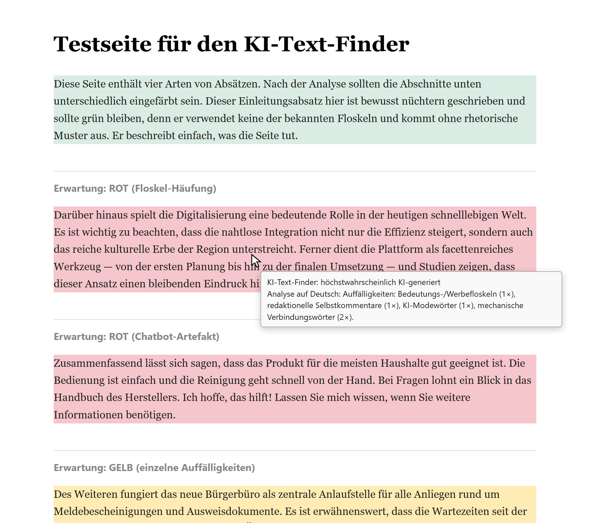
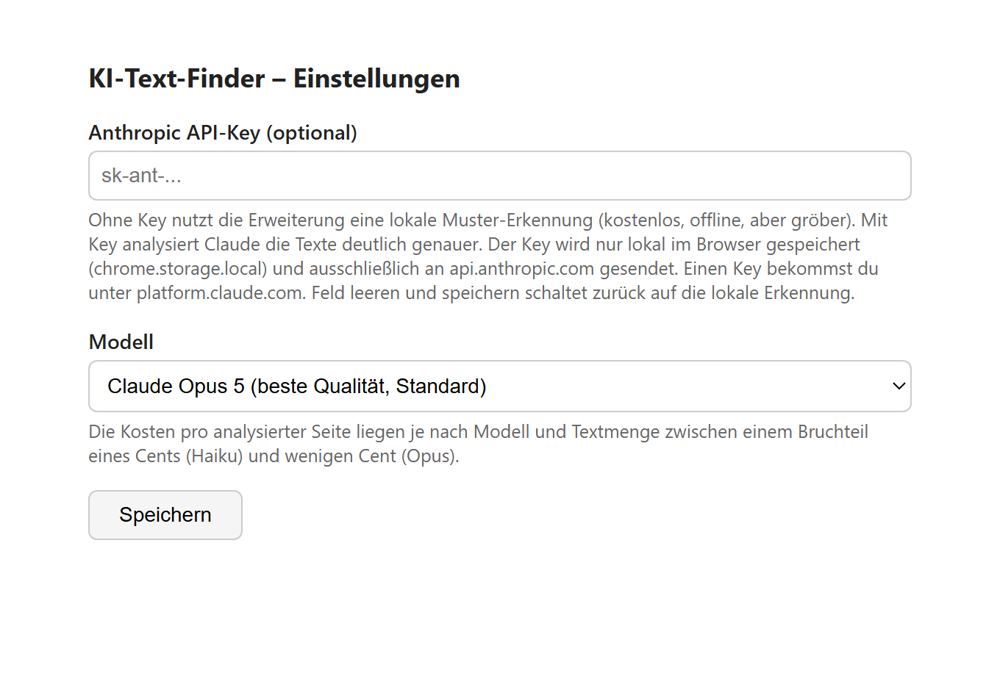
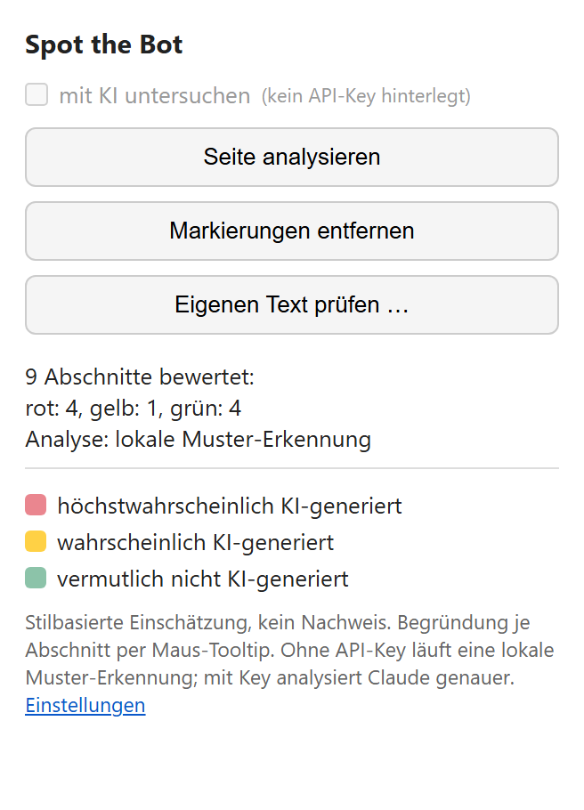
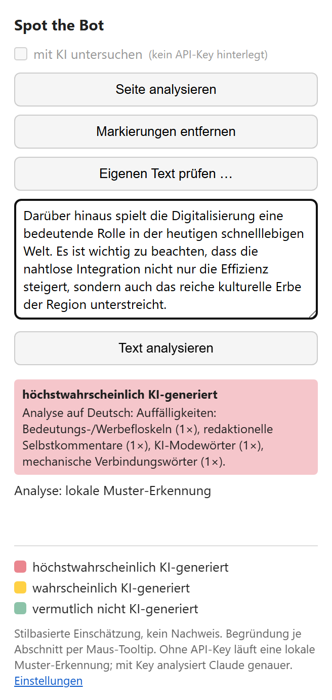
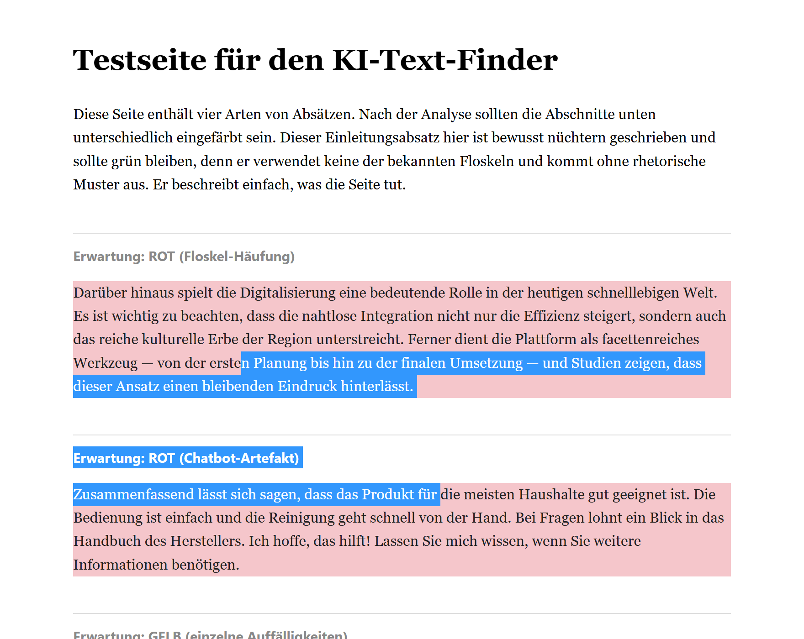
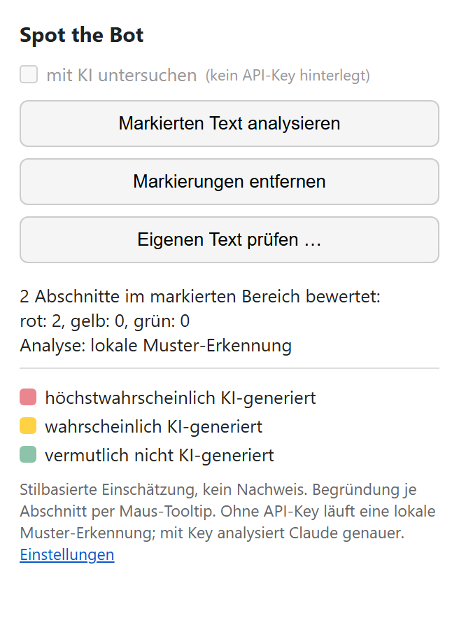

# Spot the Bot


Chrome-Erweiterung, die Textabschnitte der aktuellen Webseite danach einfärbt, wie wahrscheinlich sie KI-generiert sind. Die Bewertung folgt einem Ampelschema; die Begründung zu jedem Abschnitt erscheint als Tooltip, wenn man mit der Maus darüberfährt.

<p align="center">
  
</p>

<p align="center"><sub>Die mitgelieferte <a href="test-seite.html">Testseite</a> nach einer Analyse mit der lokalen Regel-Engine
(<a href="docs/screenshots/testseite-komplett.png">ganze Seite ansehen</a>)</sub></p>

## Ampelschema

- **Rot** – höchstwahrscheinlich KI-generiert (deutliche Häufung typischer Merkmale)
- **Gelb** – wahrscheinlich KI-generiert (einzelne klare Auffälligkeiten)
- **Grün** – vermutlich nicht KI-generiert

## Analyse-Modi

Die Erweiterung kennt zwei Wege, Texte zu bewerten:

|  | Lokale Regel-Engine (Standard) | Claude API |
|---|---|---|
| Voraussetzung | keine | Anthropic API-Key |
| Kosten | kostenlos | je nach Modell Bruchteile eines Cents bis wenige Cent pro Seite |
| Datenfluss | kein Text verlässt den Browser | Textabschnitte gehen an api.anthropic.com |
| Genauigkeit | erkennt unbearbeiteten KI-Text zuverlässig, übersieht polierten aber weitgehend | deutlich genauer, bewertet inhaltlich |

Ohne API-Key prüft die lokale Regel-Engine ([heuristik.js](heuristik.js)) die Texte auf bekannte KI-Stilmuster: Floskel-Listen, Gedankenstrich-Häufung, „nicht nur … sondern auch", Verbindungswort-Ketten, Chatbot-Zitierartefakte. Sie erkennt dabei je Abschnitt die Sprache (Deutsch/Englisch) und wendet zusätzlich sprachspezifische Signale an – im Deutschen etwa Geviertstriche, englischen Anführungszeichen-Stil und Titel-Großschreibung nach englischem Muster. Die erkannte Sprache steht mit im Tooltip. Mit Key bewertet Claude die Abschnitte. Schlägt die API fehl, fällt die Erweiterung automatisch auf die lokale Erkennung zurück; das Popup zeigt an, welcher Modus gelaufen ist.

## Installation

1. Chrome öffnen und `chrome://extensions` aufrufen
2. Oben rechts den **Entwicklermodus** aktivieren
3. **„Entpackte Erweiterung laden"** klicken und diesen Ordner auswählen
4. Optional: in den Einstellungen der Erweiterung einen Anthropic API-Key eintragen (von platform.claude.com) für die genauere Claude-Analyse

<p align="center">
  
</p>

Der Key wird nur in `chrome.storage.local` gespeichert und ausschließlich an api.anthropic.com gesendet. Feld leeren und speichern schaltet zurück auf die lokale Erkennung. Als Modell stehen Claude Opus 5 (Standard), Sonnet 5 und Haiku 4.5 zur Wahl.

## Bedienung



Icon anklicken → **„Seite analysieren"**. Nach einigen Sekunden sind die Absätze eingefärbt; das Popup zeigt die Verteilung und den verwendeten Analyse-Modus. **„Markierungen entfernen"** stellt die Seite wieder her.

Das Ergebnis geht beim Schließen des Popups nicht verloren: Beim nächsten Öffnen zeigt es die letzte Statistik wieder an, solange die Markierungen auf der Seite stehen. Kappt die Obergrenze von 120 Abschnitten die Analyse einer sehr langen Seite, sagt das Popup das („120 von 260 Abschnitten bewertet").

Über **„Eigenen Text prüfen"** lässt sich auch Text bewerten, der auf keiner Webseite steht – eine E-Mail, eine eingereichte Arbeit, ein Kommentar. Einfügen, prüfen, und das Popup zeigt die Einstufung samt Begründung je Absatz. Es gelten dieselben Regeln wie bei der Seitenanalyse (Mindestlänge 150 Zeichen, gewählter Analyse-Modus).

<p align="center">
  
</p>

Die Checkbox **„mit KI untersuchen"** steuert den Modus: Ohne hinterlegten Key ist sie ausgegraut und es läuft immer die lokale Erkennung. Mit Key ist sie standardmäßig aktiv, kann aber abgewählt werden, wenn die schnelle, kostenlose Analyse reichen soll. Die Auswahl bleibt gespeichert.

Zum Ausprobieren liegt eine [Testseite](test-seite.html) bei, deren Absätze die typischen Fälle abdecken: Floskel-Häufung und Chatbot-Artefakt, einzelne Auffälligkeiten, unauffälliger Text – jeweils auf Deutsch und Englisch, dazu ein deutscher Absatz mit englischer Typografie.

<br clear="right">

### Nur einen Ausschnitt prüfen

Ist auf der Seite Text markiert, bewertet die Erweiterung nur die Abschnitte, die die Markierung berührt – der Button heißt dann **„Markierten Text analysieren"**. Das spart im Claude-Modus Kosten und Wartezeit und erreicht auch Stellen weit unten auf sehr langen Seiten, wo die Obergrenze von 120 Abschnitten sonst greift. Bewertet und eingefärbt wird immer der ganze Absatz, auch wenn die Markierung nur einen Teil davon abdeckt. Ist die Markierung kürzer als 150 Zeichen, meldet das Popup das, statt eine Einschätzung auf dünner Grundlage abzugeben.

<table>
<tr>
<td width="66%"></td>
<td></td>
</tr>
</table>

<sub>Die Markierung reicht in zwei Absätze hinein – bewertet werden beide vollständig, der Rest der Seite bleibt unberührt.</sub>

## Wie es funktioniert

| Datei | Aufgabe |
|---|---|
| [content.js](content.js) | sammelt sichtbare Textblöcke (`p`, `li`, `blockquote`, `dd`, `figcaption`) ab 150 Zeichen, höchstens 120 pro Seite, beschränkt sie bei vorhandener Markierung auf die berührten Blöcke und färbt sie nach der Bewertung ein |
| [background.js](background.js) | Service Worker; entscheidet je nach Key zwischen lokaler Engine und Claude API und bündelt lange Seiten in mehrere Anfragen |
| [heuristik.js](heuristik.js) | lokale Regel-Engine: Spracherkennung je Abschnitt (Stoppwort-Zählung), gewichteter Punktwert über gemeinsame und sprachspezifische Musterlisten; eindeutige Chatbot-Artefakte führen direkt zu Rot |
| [popup.js](popup.js) / [popup.html](popup.html) | Popup mit Analyse-Buttons, Modus-Checkbox und Legende |
| [options.js](options.js) / [options.html](options.html) | Einstellungsseite für API-Key und Modellwahl |
| [ampel.js](ampel.js) / [modelle.js](modelle.js) | gemeinsame Definitionen: Ampelstufen (Farben, Beschriftungen, Schema-Werte) und Modell-Liste |

Die Claude-Anfragen nutzen Structured Outputs mit festem JSON-Schema, damit die Antwort maschinell auswertbar bleibt. Im lokalen Modus verlässt kein Text den Browser.

## Tests

```bash
node tests/run-tests.js
```

Prüft die Syntax aller Skripte, die Regel-Engine gegen die erwarteten Einstufungen der Testseite und das Content Script (Markierungs-Fälle, Ergebnis-Zurücksetzen) im Headless-Chrome. Läuft als GitHub Action bei jedem Push.

## Mögliche Weiterentwicklung

Für spätere Versionen angedacht, in loser Reihenfolge:

- Kontextmenü-Eintrag, um markierten Text per Rechtsklick zu prüfen
- Sprung zum nächsten roten Abschnitt aus dem Popup; Trefferzahl als Icon-Badge
- Ergebnis-Cache pro Seite, damit wiederholte Analysen keine API-Kosten verursachen
- Englische Oberfläche samt Begründungen in der Seitensprache
- Analyse von iframe-Inhalten (z. B. eingebettete Kommentarspalten)
- Test-Button für den API-Key in den Einstellungen
- Anbindung der Wasserzeichen-Detektions-API von Anthropic, sobald verfügbar
- Portierung auf Edge und Firefox

## Grenzen

Die Bewertung ist eine stilistische Einschätzung, kein Nachweis. Sie stützt sich auf bekannte Merkmale KI-generierter Texte (vgl. die Wikipedia-Seite „Signs of AI writing"). Fehleinschätzungen in beide Richtungen sind möglich: Glatter menschlicher Text kann gelb eingestuft werden, nachbearbeiteter KI-Text grün. Kurze Abschnitte (unter 150 Zeichen) werden gar nicht bewertet.

Ein harter Nachweis wäre nur über das statistische Wasserzeichen möglich, das Anthropic seit August 2026 in Claude-Ausgaben einbettet. Die dafür angekündigte Detektions-API ist noch nicht verfügbar; sobald sie erscheint, ließe sie sich hier als zweite Prüfstufe einbauen (harter Befund für Claude-Texte, Stilanalyse als Heuristik für alles andere).
